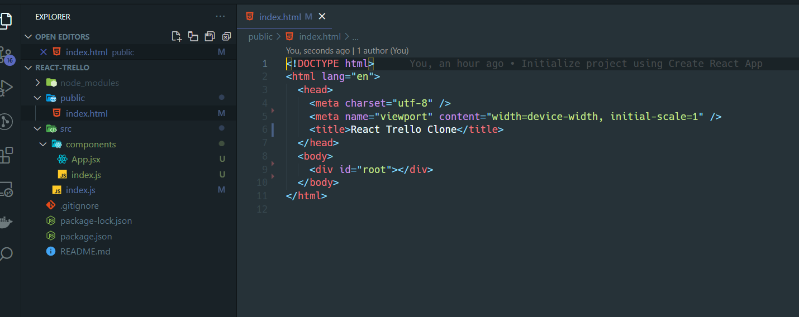

# React Trello

## Prepair
1. Создаем собственный репозиторий на гитхаб под название react-trello. Публичный или приватный - на ваше усмотрение (Если создали приватный - расшарить мне доступ. [Инструкция](https://docs.github.com/en/account-and-profile/setting-up-and-managing-your-github-user-account/managing-access-to-your-personal-repositories/inviting-collaborators-to-a-personal-repository))
2. Клоним репозиторий себе и создаем react приложения с помощью cretate-react-app:
2.1. Заходим в склонированную папку react-trello
2.2. Выполняем команду ```npx create-react-app .``` (точка обязательна и означает создать проект в текущей папке, а не создавать новую)
3. Запускаем проект с помощью команды ```npm run start```, если все ок - делаем комммит.
4. Исправляем структуру проекта:
4.1 Из папки public удаляем все, кроме index.html
4.2 Удаляем из index.html все лишнее (см. скриншот ниже)
4.3. Из папки srс удаляем все, кроме App.js и index.js
4.4. App.js переименовываем в App.jsx. Удаляем из него все импорты. экспорт меняем с дефолтного на именной, меняем реализацию так, чтобы компонент выводил только <span>Hello World</span>.
4.5. Создаем папку src/components. Переносим туда нас App.jsx + создаем там свой index.js, который делает реэкспорт App
4.6. Редактируем src/index.js:
4.6.1. Удаляем все импорты кроме ReactDom и App + исправляем импорт App на корректный (сейчас он ошибочный т.к. мы перенесли App в папку components)
4.6.2. Удаляем React.StrictMode и все что идет после вызова функции ReactDOM.render.
5. Запускает ```npm run start```, если все ок - далем коммит.
6. Пушим все это в репозиторий и скидываем мне ссылку + ФИО, если последнее не очевидно из акка телеграмма / гитхаба.
7. Создаем ветку ```feature/hm-1``` в которой будем делать таску.

## Resume
В итоге мы получили чистый и понятный проект:
- В public/index.html у нас лежит минималистичный html, у которого есть div с id="root", в этот div будет рендерится наше приложение.
- В папке src будет лежать весь основной код нашего приложение
- В src/index импортируется наше приложение ```import App``` и рендерится в браузер с помощью ReactDom в тот самый div с id="root" (```document.getElementById('root')```)
- В src/components будут лежать наши компоненты, из которых будет строится наше приложение

## FAQ
1. Как должен выглядеть index.html + итоговая структура:

2. Отличие синтаксиса дефолтного экспорта и именного:
-   дефолтный делает через ключевое слово export defaults
-   именной делается путем добавления ключевого слово export перед созданием переменной / функции / класса. Например:
```jsx
export function App () {
    ...
}
```
3. Также отличается способ последующего импорта:
- пример дефолтного импорта виден после создания приложения с помощью create-react-app
- именной импорт делается через фигурные скобки. Имена переменных при импорте и экспорте обязаны совпадать. Например:
```jsx
// src/components/index.js
export { App } from './App';

// src/index.js
import { App } from './components';
```
4. Реэкспорт через index.js файлы нужен для вебпака, позволяет нам писать более короткие пути импорта: нам достаточно будет указать путь к папке и не придется указывать путь к конкретному файлу в ней. Сам index.js должен содержать только код реэскпорта, например:
```jsx
export { someFunction } from './'someFile';
```
